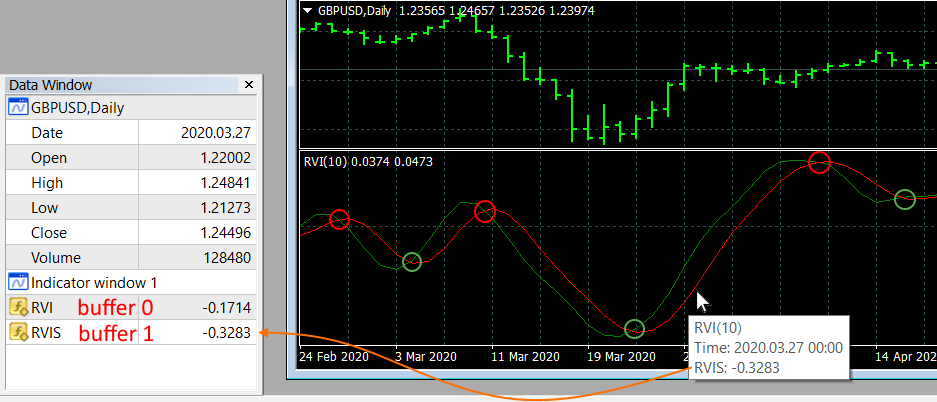
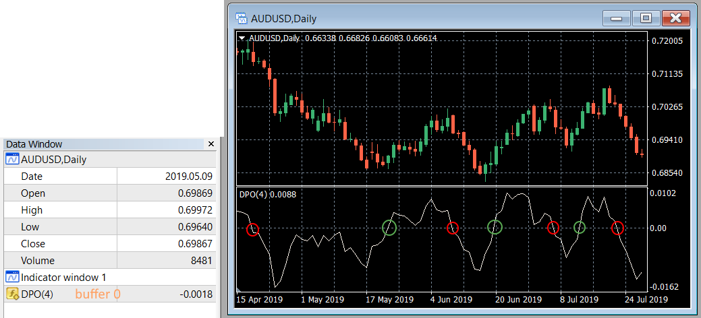
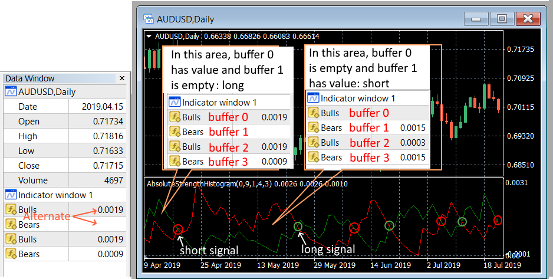

# nnfx-backtest

Expert Advisor to backtest **confirmation** indicators in NNFX way

Video: [https://vimeo.com/394968423][https://vimeo.com/394968423]

## How to Use:

* Put the NNFX_Backtest_C1.ex4 in MQL4/Experts folder
* Open Strategy Tester in MetaTrader4 and select Expert Advisor NNFX_Backtest_C1.ex4
* Configure it like below image:

* Click on "Expert Properties" and fill `C1 Type` and `C1 Parameters` (double click field in "Value" column):

    * C1 Type: Dropdown type of the indicator to test.
    * C1 Parameters: semicolon-separated of parameters in this order: `inputs`; `indicator_name`; `buffers`
        * `inputs`: comma-separated list of inputs. You can omit parameters on the right, the EA will apply default values for these inputs. So you can leave blank to test with all default inputs. For inputs of type dropdown, it is necessary to put the position, starts at 0, of option in dropdown.
        * `indicator_name`: the name of compiled indicator relative to the root indicators directory (MQL4/Indicators/). If the indicator is located in subdirectory, for example, in MQL4/Indicators/Examples, its name must be specified as "Examples\\indicator_name".
        * `buffers`: comma-separated list of buffers, start at 0, of the indicator (Data Window).
* Select "Open prices only" model and click on "Start": 

> Note: If the indicator is not shown in chart, check if the journal tab shows any error.

## Type of Indicators:

Indicator | Inputs | Signal
--------- | ---------- | -----
2Line Cross | `param1,param2,param3`;`indicator_name`;`1ºbuffer,2ºbuffer` | Buy when `1ºbuffer` cross `2ºbuffer` and is above. Sell otherwise
ZeroLine Cross | `param1,param2,param3`;`indicator_name`;`buffer` | Buy when `buffer` cross above 0. Sell when `buffer` cross below 0
Histogram | `param1,param2,param3`;`indicator_name`;`1ºbuffer,2ºbuffer` | Buy when `1ºbuffer` is filled. Sell when `2ºbuffer` is filled

> Note: In order to identify the type of indicator, you should put the indicator on chart and mouse hover candles and see in `Data Window` how values are changed.

### 2Line Cross

You must use `2 Line Cross` when the graph of indicator has two continuous lines that intersect between them.
 Buy signal is given when the value of `1ºbuffer` cross `2ºbuffer` and is above.
 Sell signal is given when the value of `1ºbuffer` cross `2ºbuffer` and is below. 

In this example, putting the mouse over indicator RVI we see in `Data Window` that values of `1º buffer` in position `0` refers to green line, and values of `2º buffer` in position `1` refers to red line.
 So, the list of positions of buffers for this indicator is `0,1`

> Tip: for this example we use C1 Type: `2 Line Cross` and C1 Params: `10;RVI;0,1`

### Zeroline Cross

`Zeroline Cross` is used when the indicator has a continuous line that cross 0 value.
 Buy signal is given when the value of `buffer` cross value 0 and is above.
 Sell signal is given when the value of `buffer`  cross value 0 and is below 0. 

> Tip: for this example we use C1 Type: `Zeroline Cross` and C1 Params: `4;DPO;0`

In this example, putting the mouse over indicator DPO we see in `Data Window` that values of `buffer` (position 0 in Data Window) refers to white line.
 So, the list of positions of buffers for this indicator is `0`

### Histogram

`Histogram` is used when the indicator has two buffers where one is alternately filled and other is empty.
 Buy signal is given when `1ºbuffer` has values and `2ºbuffer` is empty.
 Sell signal is given when `1ºbuffer` is empty and `2ºbuffer` has values. 

In this example, putting the mouse over indicator Absolute_Strength_Histogram we see in `Data Window` that values of `1ºbuffer` (position 0 in Data Window) refers to green line, and values of `2ºbuffer` (position 1 in Data Window) refers to red line.
 So, the list of positions of buffers for this indicator is `0,1`

> Tip: for this example we use C1 Type: `Histogram` and C1 Params: `0,9,1,4,0,3,3;Absolute_Strength_Histogram;0,1`

## Backtest Results:

To see the report of backtest you can check the Report tab. You also can see how many orders where closed on opposite signal in Journal tab.
Winrate Estimated is calculated by wins / (wins + losses) but all wins or losses of opposite sinal only counts half.

## Optimization:

In order to search for the best parameters for your indicator you can use the optimization. To do this put #1, #2,... as parameter you will use optimization.
In the example above you could use `0,#1,#2,#3,3` in inputs where #1 is Input1, #2 is Input2, #3 is Input3:

Click on checkbox optimization and start test.

As you can see the test with Input1=11, Input2=1  (inputs `0,11,1,4,0,3,3`) got best results.

[https://vimeo.com/394968423]: https://vimeo.com/394968423

## Limitations:

The strategy tester in "Open prices only" model check signals on every new candle at 0:00. At this point, we can't use the close price for it is not yet formed.
Because this the EA use the close of previous candle to check signals. When there are entry signals (previous close), the order will be open with current Bid/Ask price, which does not correspond to the closing price of the previous candle.