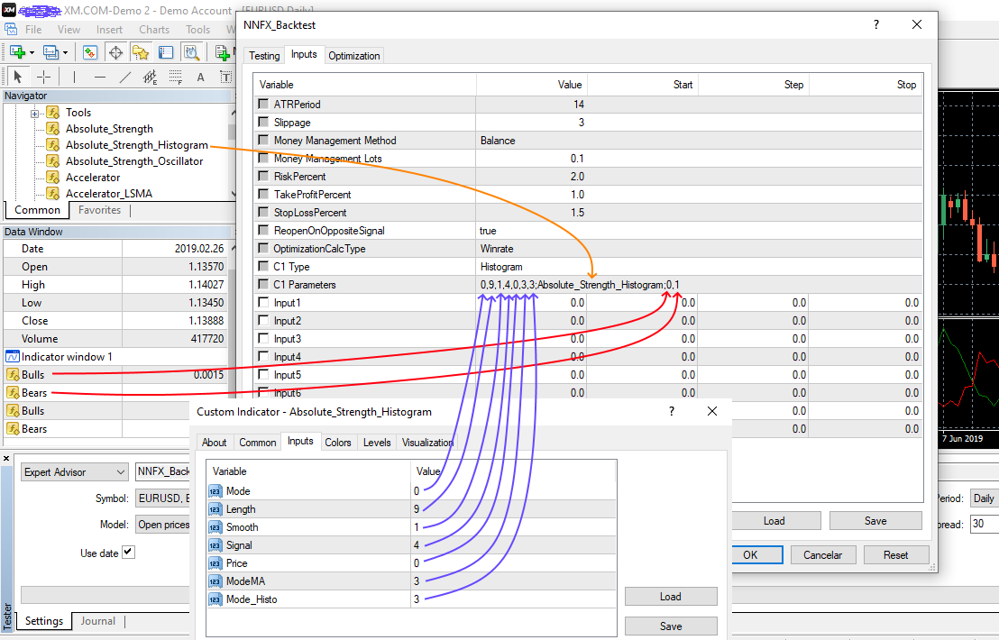
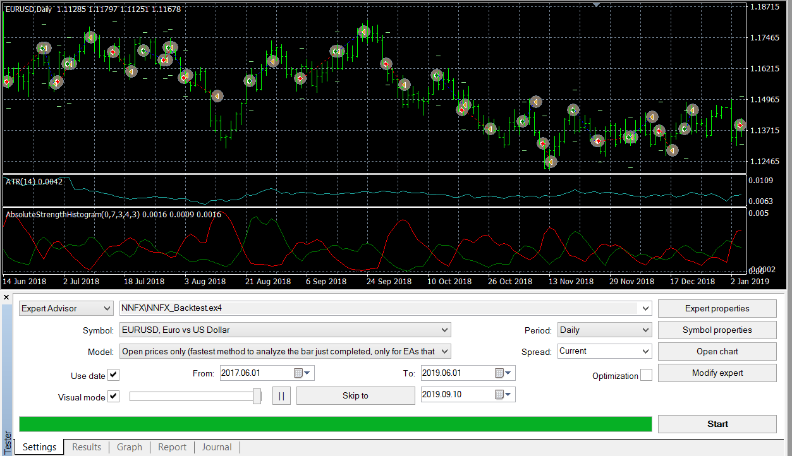
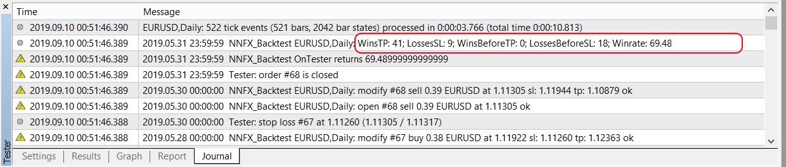
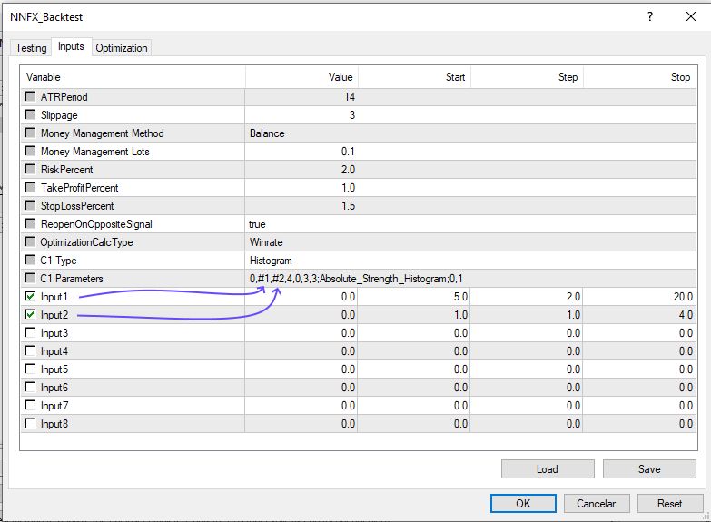
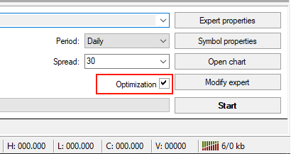
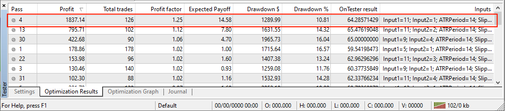

# nnfx-backtest

Expert Advisor to backtest **confirmation** indicators in NNFX way

## How to Use:

* Put the NNFX_Backtest.ex4 in MQL4/Experts folder
* Open Strategy Tester in MetaTrader4 and select Expert Advisor NNFX_Backtest.ex4
* Configure it like below image:

* Click on "Expert Properties" and fill `C1 Type` and `C1 Parameters` (double click field in "Value" column):

    * C1 Type: Dropdown type of the indicator to test.
    * C1 Parameters: semicolon-separated of parameters in this order: `inputs`; `indicator_name`; `buffers`; `levels`
        * `inputs`: comma-separated list of inputs. You can omit parameters on the right, the EA will apply default values for these inputs. So you can leave blank to test with all default inputs.
        * `indicator_name`: the name of compiled indicator relative to the root indicators directory (MQL4/Indicators/). If the indicator is located in subdirectory, for example, in MQL4/Indicators/Examples, its name must be specified as "Examples\\indicator_name".
        * `buffers`: comma-separated list of buffers, start at 0, of the indicator.
        * `levels`: comma-separated list levels. Only aplies to `1Level Cross` and `2Level Cross` types.
* Select "Open prices only" model and click on "Start": 

> Note: If the indicator is not shown in chart, check if the journal tab shows any error.

## Type of Indicators:

Indicator | Inputs | Signal
--------- | ---------- | -----
2Line Cross | `param1,param2,param3`;`indicator_name`;`buffer0,buffor1` | When `buffer0` cross `buffer1`
ZeroLine Cross | `param1,param2,param3`;`indicator_name`;`buffer0` | When `buffer0` cross value 0
1Level Cross | `param1,param2,param3`;`indicator_name`;`buffer0`;`value0` | When `buffer0` cross `value0` 
2Level Cross | `param1,param2,param3`;`indicator_name`;`buffer0`;`value0,value1` | When `buffer0` cross `value0` or when `buffer1` cross `value1`
Single Line | `param1,param2,param3`;`indicator_name`;`buffer0` | When `buffer0` starts grow up or go down
Histogram | `param1,param2,param3`;`indicator_name`;`buffer0,buffor1` | When `buffer0` is filled or when `buffer1` is filled

## Examples:

C1 Type | C1 Parameters
------- | -------------
2Line Cross | 10;RVI;0,1
ZeroLine Cross | 4;DPO;0
1Level Cross | 14;ADX;25
2Level Cross | 10,23,50;Schaff_Trend_Cycle;95,5
Single Line | 14;Hull_MA;0
Histogram | 0,9,1,4,0,3,3;Absolute_Strength_Histogram;0,1

## Backtest Results:

To see the report of backtest you can check the Report tab. You also can see how many orders where closed on opposite signal in Journal tab.
Winrate is calculated by wins / (wins + losses) but all wins or losses of opposite sinal only counts half.

## Optimization:

In order to search for the best parameters for your indicator you can use the optimization. To do this put #1, #2,... as parameter you will use optimization.
In the example above you could use `0,#1,#2,#3,3` in inputs where #1 is Input1, #2 is Input2, #3 is Input3:

Click on checkbox optimization and start test.

As you can see the test with Input1=11, Input2=1  (inputs `0,11,1,4,0,3,3`) got best results.