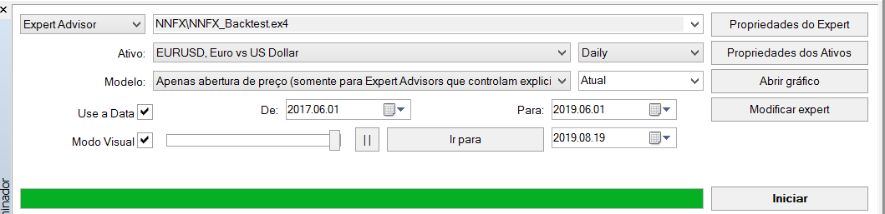
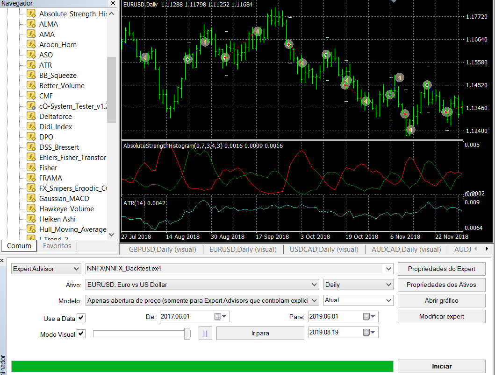
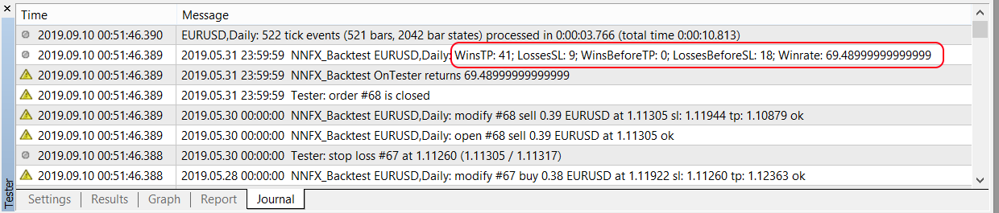
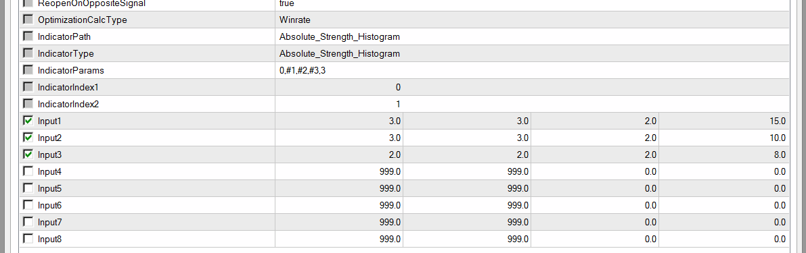
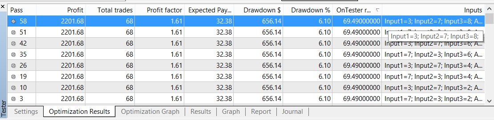

# nnfx-backtest

Expert Advisor to backtest confirmation indicators in NNFX way

## How to Use:

* Put the NNFX_Backtest.mq4 in MQL4/Experts folder
* Refresh list of Expert Advisors to compile the EA
* Open Strategy Tester in MetaTrader4 and select Expert Advisor NNFX_Backtest.ex4
* Configure it like below image:

* Click on "Expert Properties" and fill IndicatorPath, IndicatorType and IndicatorParams (double click field in "Value" column):

    * IndicatorPath: the name of compiled indicator relative to the root indicators directory (MQL4/Indicators/). If the indicator is located in subdirectory, for example, in MQL4/Indicators/Examples, its name must be specified as "Examples\\indicator_name".
    * IndicatorType: Dropdown of the indicator to test.
    * IndicatorParams: comma-separated list of parameters. You can omit parameters on the right, the EA will apply default values for these parameters. So you can leave blank to test with all default parameters.
* Select "Open prices only" model and click on "Start": 

> Note: If the indicator is not shown in chart, check if the journal tab shows any error.

## Generic Indicators:

There are several built-in indicators available, but you can test many indicators type 2LineCross and ZeroLine by select IndicatorType: 

* 2LineCross: indicators that gives sinal when two lines crosses. Fill IndicatorIndex1 and IndicatorIndex2 (see in tab "Colors" of indicator) to specify lines of indicator to cross.
* ZeroLine: indicators that gives sinals when the value cross 0 line. Fill IndicatorIndex1 to specify the line of indicator to cross zero line.

> Note: It is only possible to place indicators with numeric parameters in this way.

## Built-In Indicators:

To be easier to use, you can use these built-in indicators available:

Indicator | Type  | Default Params
--------- | ----- | --------------
Absolute_Strength_Histogram | 2LineCross | 0,9,1,4,0,3,3
Accelerator_LSMA | ZeroLine | 5,34,5
Vortex | 2LineCross | 14
RVI | 2LineCross | 10
Aroon_Horn | 2LineCross | 10
ASO | 2LineCross | 10,0
SSL | 2LineCross | 10,0
TSI | ZeroLine | 5,8
Schaff_Trend_Cycle | 2LineCross | 10,23,50
Waddah_Attar_Explosion | Other | 150,30,15,15

> Note: Each of these indicators has been prepared for a specific version. If you have a different version or is not shown in this list, ask me to include it in EA.

## Backtest Results:

To see the report of backtest you can check the Report tab. You also can see how many orders where closed on opposite signal in Journal tab.
Winrate is calculated by wins / (wins + losses) but all wins or losses of opposite sinal only counts half.

## Optimization:

In order to search for the best parameters for your indicator you can use the optimization. To do this put #1, #2,... as parameter you will use optimization.
In the example above you could use `0,#1,#2,#3,3` in IndicatorParams where #1 is Input1, #2 is Input2, #3 is Input3:

Click on checkbox optimization and start test.

As you can see the test with Input1=3, Input2=7, Input3=8  (parameters `0,3,7,8,3`) got best results.