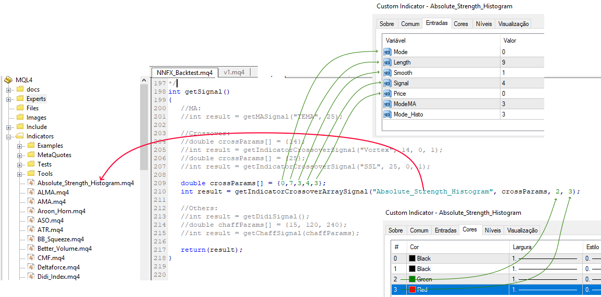

# nnfx-backtest
Exper Advisor to backtest trend indicators in nnfx way

## How to Use:
* Open NNFX_backtest.mq4 in MetaEditor
* Go to getSignal() function
* Uncomment only the indParams and the line of indicator to test. Make sure that if we are call getIndicator* function, the first parameter is the name of compiled indicator relative to the root indicators directory (MQL4/Indicators/). If the indicator is located in subdirectory, for example, in MQL4/Indicators/Examples, its name must be specified as "Examples\\indicator_name".
* Save the file
* Compile
* Open MetaTrader4 and open Strategy Tester, select Expert Advisor NNFX_Backtest

## Test Other Indicators:
Beyond the examples in getSignal() function, we can test specific indicators, through one of three functions:
* getIndicatorMASignal: return LONG signal when Moving Avarage starts to rise; return SHORT signal when Moving Avarage starts to go down.
* getIndicatorZerocrossSignal: return LONG signal when the indicator cross 0 line to up; return SHORT signal when the indicator cross 0 line to down.
* getIndicatorCrossoverSignal: return LONG or SHORT signal when two lines crosses.