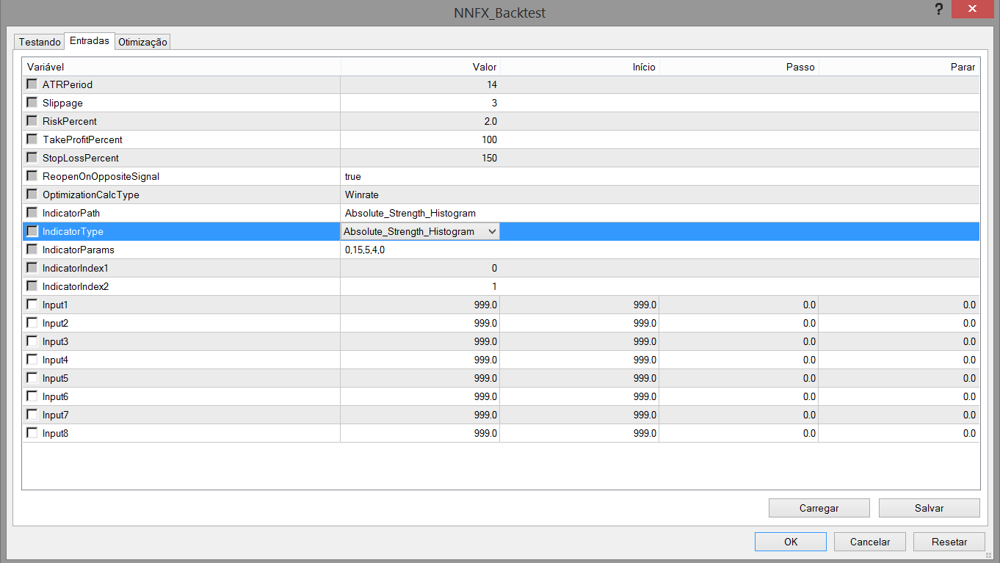

# nnfx-backtest
Expert Advisor to backtest confirmation indicators in NNFX way

## How to Use:
* Put the NNFX_Backtest.mq4 in MQL4/Experts folder
* In MetaTrader compile the EA by refresh list of Expert Advisors
* Open Strategy Tester
* Open Strategy Tester in MetaTrader4 and select Expert Advisor NNFX_Backtest.ex4
* Configure like below image.

* Click on Expert Properties and fill IndicatorPath, IndicatorType and IndicatorParams:
    * IndicatorPath: the name of compiled indicator relative to the root indicators directory (MQL4/Indicators/). If the indicator is located in subdirectory, for example, in MQL4/Indicators/Examples, its name must be specified as "Examples\\indicator_name".
    * IndicatorType: Dropdown of the indicator we want test.
    * IndicatorParams: comma-separated list of parameters. Leave blank to test with default parameters.

    
* If the indicator is not shown in chart, check if the journal tab shows any error

## Generic Indicators:
In Expert Properties change IndicatorType to one of these values: 
* Crossover: to test indicators that gives sinal when two lines crosses. Fill IndicatorIndex1 and IndicatorIndex2 to specify lines of indicator to cross.
* Zeroline: test indicators that gives sinals when the value cross 0 line. Fill IndicatorIndex1 to specify the line of indicator to cross zero line.

## Test Built-In Indicators:

Indicator | Type  | Default Params
--------- | ----- | --------------
Absolute_Strength_Histogram | Crossover | 0,9,1,4,0,3,3
Accelerator_LSMA | Zeroline | 5,34,5
Vortex | Crossover | 14
RVI | Crossover | 10
Aroon_Horn | Crossover | 10
ASO | Crossover | 10,0
SSL | Crossover | 10,0
TSI | Zeroline | 5,8
Schaff_Trend_Cycle | Crossover | 10,23,50
Waddah_Attar_Explosion | Others | 150,30,15,15